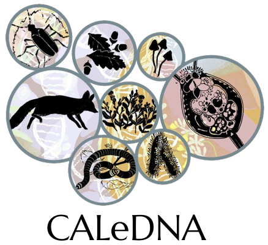
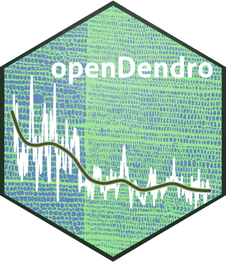

# Research

## Current Projects

### [eDNA](https://ucedna.com/our-mission)

{width="100px"}

The eDNA project aims to help Conservation Biologists to effectively monitor species distribution and establish reliable baselines of the Californian biodiversity. As DNA data is everexpanding, the eDNA team and CyVerse are working together for a solution for hosting, processing and making the data accessible for scientists worldwide.

Find out how you can help:
- [Documentation](https://ucedna.com/our-mission).

### [Opendendro](https://opendendro.org/)

{width="100px" height="87px"}

Managing and helping with the porting of the OpenDendro software to the Python computing language.
OpenDendro is a an open-source framework of the base analytic software tools used in dendrochronology, currently available in [R (dplR)](https://opendendro.org/r/) and being developed for [Python (dplPy)](https://opendendro.org/python/) (alpha).

- Documentation and repository:
    - [Documentation](https://opendendro.org/).
    - [GitHub Repository (dplPy)](https://github.com/OpenDendro/dplPy).

---

## Previous Projects

### [PhytoOracle](https://github.com/phytooracle)

{width="128px" height="128px"}

During my time as a graduate student at the University of Arizona, I had the opportunity to assist the PhytoOracle project.

- PhytoOracle is a scalable, distrubted workflow manager developed for analysis of high throughput phenotype data, designed (but not limited!) for processing data from the University of Arizona Gantry (the World's largest agricultural robot). 
- Contributions include: 
    - Building workflows using the [CCTools](https://ccl.cse.nd.edu/software/downloadfiles.php) foreman-worker framework.
    - Large scale phenotype extraction.
    - Big Data management and processing.
- Learn more on PhytoOracle:
    - North American Plant Phenotyping Network (NAPPN 2022) [conference article](https://www.essoar.org/doi/10.1002/essoar.10508789.1). 
    - Find out what the Wall Street Journal had to say about PhytoOracle: [WSJ article](https://www.wsj.com/articles/how-a-30-ton-robot-could-help-crops-withstand-climate-change-11597237276).
    - Watch PhytoOracle on [YouTube](https://www.youtube.com/watch?v=da2gKRdMeXY).
- Documentation and repository:
    - [Documentation](https://phytooracle.readthedocs.io/en/latest/).
    - [GitHub Repository](https://github.com/phytooracle).

### [StarBLAST](https://github.com/LyonsLab/StarBLAST) 

{width="257px" height="575px"}

Primary maintainer and developer of StarBLAST.

- StarBLAST is a scalable extension of [SequenceServer](http://sequenceserver.com/) BLAST, making BLAST accessible to educators and researchers running classroom-scale searches concurrently. The idea first originated when long queue times would disrupt lectures based on the [BLAST](https://blast.ncbi.nlm.nih.gov/Blast.cgi) software, turning educators to look for a solution. StarBLAST was created with this in mind: making BLAST accessible to all levels and sizes of classrooms.
- Learn more on StarBLAST:
    - Official scientific publication at Journal of Open Source Education (JOSE): https://jose.theoj.org/papers/10.21105/jose.00102
    - Read the concepts behind StarBLAST on [Medium](https://medium.com/@samanthalrobbins/starblast-cafd04f7916a)).
- Documentation and repository:
    - [Documentation](https://starblast.readthedocs.io/en/latest/).
    - [GitHub Repository](https://github.com/LyonsLab/StarBLAST).
